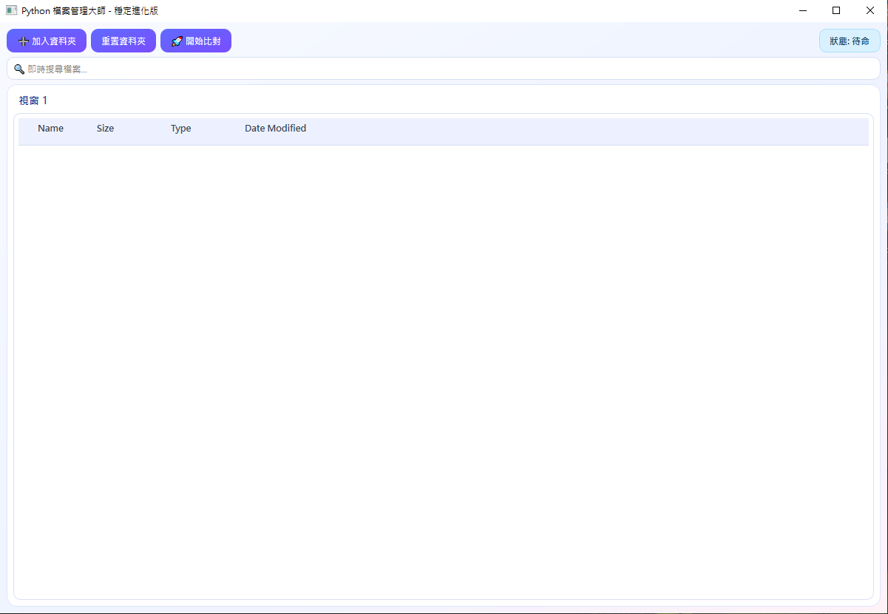
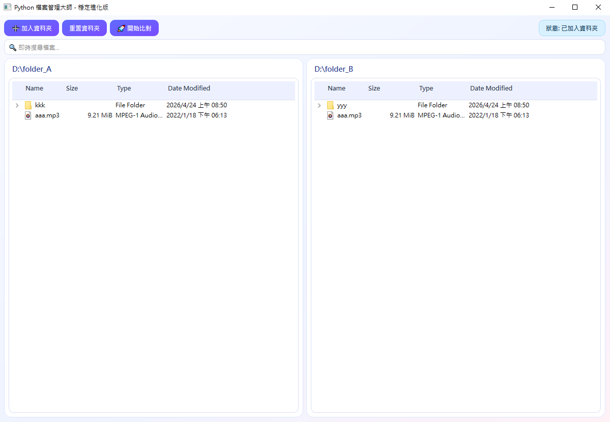
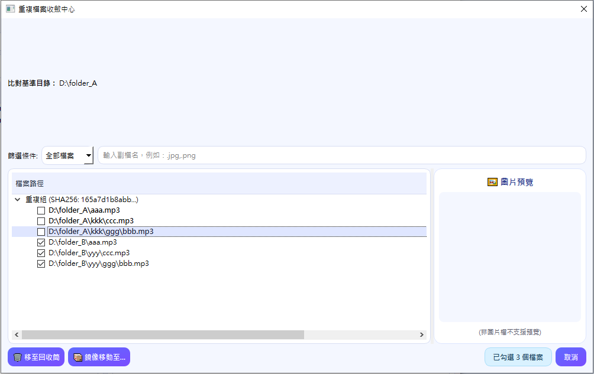

# File Management Tool v1.0

A desktop file management utility built with Python + PyQt6, focused on **cross-directory duplicate file detection** and **batch organization**. Ideal for users who need to clean up large collections of photos, videos, or documents.

---

## Features

| Feature | Description |
|---------|-------------|
| 📁 Quad-panel View | Browse up to 4 folders simultaneously with expandable tree views |
| 🔍 SHA-256 Deduplication | Content-based hash comparison — filename and timestamp independent |
| ⚡ Async Scanning | Background thread scanning keeps the UI responsive; cancellable at any time |
| 🗑️ Send to Recycle Bin | Safely move selected duplicates to the system recycle bin (recoverable) |
| 📦 Mirror Move | Move files to a target directory while preserving the original folder structure |
| 🧹 Empty Folder Cleanup | Detects empty directories after move/delete and offers cascading removal |
| 🖼️ Image Preview | Click any image file in the list for an instant thumbnail preview with size info |
| 🏷️ Extension Filter | Built-in filters for photos, videos, audio, documents, archives, and custom extensions |
| 💾 Window Size Memory | Remembers and restores the window size on next launch |

---

## Screenshots

**1. Main window — ready state**  


**2. Dual-panel view — two folders loaded for comparison**  


**3. Duplicate Convergence Center — scan results with file actions**  


---

## Requirements

- Python 3.10 or later
- Windows 10 / 11 *(macOS/Linux should work in theory but are not fully tested)*

---

## Installation

### 1. Create a virtual environment (recommended)

```bash
python -m venv .venv
.venv\Scripts\activate
```

### 2. Install dependencies

```bash
pip install PyQt6 send2trash
```

Or via requirements.txt (if provided):

```bash
pip install -r requirements.txt
```

---

## Usage

```bash
python main.py
```

---

## How It Works

### Basic Workflow

1. **Add a folder**  
   Click **➕ Add Folder** to select a directory.  
   - **Panel 1 (the first folder added) is the primary directory** — files here are marked as *recommended to keep*.  
   - Up to 4 folders can be loaded for cross-directory comparison.

2. **Start scan**  
   Click **🚀 Start Scan**. The tool recursively scans all panels, computes SHA-256 hashes, and groups duplicates.

3. **Duplicate Convergence Center**  
   After scanning, a dialog shows all duplicate groups:
   - ✅ **Recommended to keep** (located in primary directory) — unchecked by default
   - ⚠️ **Recommended to remove** (duplicate copy) — checked by default

   Use the extension filter to focus on a specific file type (e.g., photos only), or click an image entry to preview its thumbnail.

4. **Execute action**  
   - **🗑️ Send to Recycle Bin** — moves checked files to the system recycle bin
   - **📦 Mirror Move to...** — select a target directory, review the path mapping, then confirm

5. **Empty folder cleanup** *(optional)*  
   After the operation, if empty directories are detected, you will be asked whether to remove them (cascades upward, stopping at the primary directory boundary).

### Live Search

Type in the search bar to instantly filter the file tree across all panels using wildcard matching.

### Reset

Click **Reset Folders** to clear all panels and return to the initial state.

---

## Project Structure

```
duplicate-file-manager/
├── main.py        # Main application (single-file architecture)
├── README.md      # This document
└── assets/
    ├── screenshot_01_main.png
    ├── screenshot_02_dual_panel.png
    └── screenshot_03_convergence.png
```

### Code Architecture

```
main.py
├── ScanWorker (QObject)               # Async scan worker
│   ├── calculate_hash()               # SHA-256 chunked computation
│   └── run()                          # Main scan loop (runs in QThread)
│
├── _find_source_root()                # Helper: find deepest matching root
├── _safe_relpath()                    # Helper: safe relative path (cross-drive safe)
│
├── MovePreviewDialog (QDialog)        # Mirror move preview dialog
├── ConvergenceDialog (QDialog)        # Duplicate convergence center dialog
│   ├── _get_filter_exts()             # Extension filter logic
│   ├── apply_tree_filter()            # Tree filtering and check count update
│   ├── _update_preview()              # Image thumbnail preview
│   └── finish()                       # Collect checked results and close
│
└── MainWindow (QMainWindow)           # Main application window
    ├── setup_ui()                     # Build quad-panel UI
    ├── add_dir()                      # Add folder to a panel
    ├── reset_main_dir()               # Reset all panels
    ├── start_scan()                   # Launch async scan
    ├── on_done()                      # Post-scan handler
    ├── _collect_initial_empty_dirs()  # Collect empty dir candidates after move
    ├── _delete_empty_dirs_cascade()   # Cascade-delete empty directories
    ├── _release_panel_watchers()      # Temporarily release file watchers (Windows lock prevention)
    └── _restore_panel_watchers()      # Restore panel file watchers
```

---

## Technical Notes

### SHA-256 Hash Comparison

Duplicate detection is based purely on file content (SHA-256), independent of filename or modification time.  
Files are read in 1 MB chunks to avoid excessive memory usage with large files.

### Mirror Move

When moving files to a new directory, the tool preserves the sub-directory structure relative to the source root — files are never flattened into a single level.

**Example:**
```
Source root : D:\Photos\2023
File path   : D:\Photos\2023\Travel\Japan\IMG_001.jpg
Target root : E:\Backup

Result      : E:\Backup\Travel\Japan\IMG_001.jpg   ✅ Structure preserved
```

### Empty Folder Cleanup

Uses `os.rmdir` (not `shutil.rmtree`) to attempt deletion — if a directory is not empty, it stops automatically, preventing accidental data loss. Cascades upward until the primary directory boundary is reached; the primary directory itself is always protected.

---

## Dependencies

| Package | Purpose |
|---------|---------|
| [PyQt6](https://pypi.org/project/PyQt6/) | GUI framework (widgets, signals/slots, threading) |
| [send2trash](https://pypi.org/project/send2trash/) | Cross-platform safe send-to-recycle-bin |

Standard library: `sys`, `os`, `hashlib`, `shutil`, `sqlite3`, `time`

---

## License

MIT License — free to use and modify.
